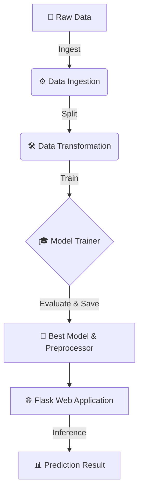

# AI-Based Student Performance Prediction System

A professional ML project using an end-to-end pipeline architecture to predict student performance.

---

## 📂 Project Structure

```text
student_performance_project/
│
├── artifacts/           # Trained models and preprocessor objects
│   ├── model.pkl
│   └── preprocessor.pkl
│
├── Data/                # Raw dataset
│   └── students_data.csv
│
├── src/
│   ├── components/      # Pipeline components
│   │   ├── data_ingestion.py
│   │   ├── data_transformation.py
│   │   └── model_trainer.py
│   │
│   ├── pipeline/        # Orchestration pipelines
│   │   ├── train_pipeline.py
│   │   └── predict_pipeline.py
│   │
│   ├── logger.py        # Logging system
│   ├── exception.py     # Custom exception handling
│   └── utils.py         # Utility functions
│
├── templates/           # Flask HTML templates
├── static/              # CSS/Static files
├── app.py               # Flask application entry point
├── requirements.txt
└── README.md
```

## ⚙️ Setup & Installation

1. **Install dependencies**
   ```bash
   pip install -r requirements.txt
   ```

2. **Train the Pipeline**
   ```bash
   # Generates models and preprocessor in artifacts/
   python -m src.pipeline.train_pipeline
   ```

3. **Run the Web App**
   ```bash
   # Start the Flask portal
   python app.py
   ```

---

## 🚀 AI Pipeline Workflow



### Pipeline Components:
1.  **Data Ingestion**: Reads raw CSV data, creates artifacts folder, and performs train-test split.
2.  **Data Transformation**: Handles missing values and scales features using a professional `ColumnTransformer` and `Pipeline`.
3.  **Model Trainer**: Automatically trains multiple models (Random Forest, Logistic Regression, etc.) and picks the best-performing one.
4.  **Prediction Pipeline**: A standalone module that takes user input, applies the trained transformations, and returns a prediction.

---

## 🛠️ Features
- **Standardized Logging**: Every step of the pipeline is logged for debugging.
- **Custom Error Handling**: Detailed error messages including file names and line numbers.
- **Automated Preprocessing**: Uses robust sklearn pipelines for numerical scaling.
- **Model Selection**: Automatically selects the best machine learning model based on accuracy.